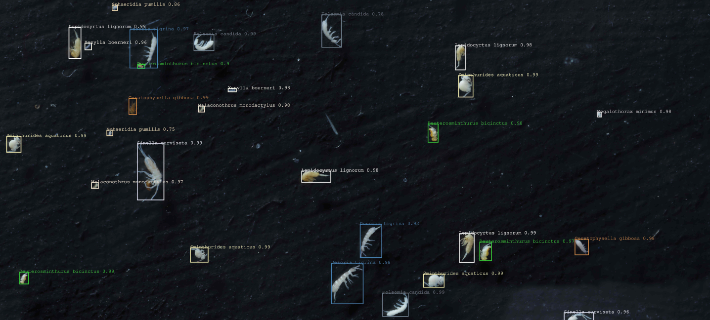

# Welcome to CollembolAI

- [Introduction](##introduction)

- [Installation](#installation)
  
  - [Dependencies](#dependencies)
  - [Install in conda enviorment](#install-in-conda-enviorment)
  - [Install in venv](#install-in-venv)
  - [Download pretrained model](#download-pretrained-model)

- [Usage](#usage)
  
  - [Example of configuration file](#example-of-configuartion-file)
  
  - [Running the pipeline](#running-the-pipeline)

- [HoverMacroCam](#hovermacrocam)

- [Building a dataset](#building-a-dataset)
  
  - [Acquire pictures](#acquite-pictures)
  
  - [Annotate pictures](#anotate-pictures)

## Introduction

in this project we retrained the popular [Faster R-CNN](https://arxiv.org/pdf/1506.01497.pdf) Convolutional Neural Network using Facebooks [Detectron2](https://github.com/facebookresearch/detectron2) Framework to detect and classify species in a mock community of soil mesofauna preserved in ethanol. The community is made of 10 Collembola species and 2 Acari species, and were acquired using our homemade macrophotography workflow "HoverMacroCam" (described in Sys et al (submitted), arduino control scripts provided here, contact us for details in the mean time).

1. Sinella curviseta
2. Lepidocyrtus lignorum
3. Desoria tigrina
4. Sphaeridia pumilis
5. Sminthurides aquaticus
6. Megalothorax minimus
7. Folsomia candida
8. Deuterosminthurus bicinctus
9. Ceratophysella gibbosa
10. Xenylla boerneri
11. Malaconothrus monodactylus
12. Hypochthonius rufulus

We provide a wrapper script, collembolAI.py, written in python to perform the inference workflow on ones dataset with only having to change a few lines of code - if at all. Furthermore this wrapper script simplifies the registration of custom datasets. Since we provide our own trained model you can retrain this model to extend it's classes and usability.

Currently we expect the labeled image data to be labeled in COCO format as this immensely simplifies the registration process with Detectron2. For our own labeling workflow we used [labelImg](https://github.com/tzutalin/labelImg) with PascalVOC labels format. The conversion to COCO format can be done with [voc2coco](https://github.com/yukkyo/voc2coco), a version of the script is distributed in this project.

We wrote the code on a machine running Ubuntu 20.04 LTS/Arch, but any Linux environment allowing you to run Pytorch with proprietary Nvidia drivers (tested with 450.102.04) and CUDA (tested with 11.0/1/3 & 10.2 - we recommend 11.3 or 10.2 LTS) should work. MacOS and Windows could also work if you get Detectron running, but no guarantees on that. The VRAM you will need, will depend on the model you take from the [Model Zoo](https://github.com/facebookresearch/detectron2/blob/main/MODEL_ZOO.md). We were using the Faster R-CNN R50-FPN model on a RTX 2060 Super GPU without any hassles.

## Installation

### Dependencies

1. Python 3 and few packages found in [environment.yaml](environment.yaml)

2. Detectron 2 - since we use the Detectron2 API we have the same Dependecies. Please refer to their [Documentation](https://detectron2.readthedocs.io/tutorials/install.html#requirements).

3. CUDA enabled Nvidia GPU -> checkout the [compatibility list ](https://detectron2.readthedocs.io/en/latest/tutorials/install.html#install-pre-built-detectron2-linux-only) of detectron and CUDA (We ran it on a RTX 2060 Super, Nvidia Titan X and V100)


### Install in conda enviorment

 Suggestion on how to install Detectron2 with CAI:

```bash
# clone the git
git clone https://github.com/stasys-hub/Collembola_AI.git 
# move to git dir
cd Collembola_AI 
# install with conda/mamba*
conda env create -f environment.yaml
# activate the environment
conda activate collembola_AI
```

\* for better performance we would suggest to install conda and then use [https://github.com/mamba-org/mamba](mamba) as a drop-in replacement for conda, which is way faster

### Install in venv

Replace values in [ ] according to your system.

You will probably have to get your hands dirty and find out which cuda version + detectron2 + pytorch works for you!

```bash
# create a python env with python 3 (tested with 3.8+)
python -m venv [path/to/env]

# activate env
source activate [path/to/env]/bin/activate

# install pytorch and torchvision for e.g. CUDA 11.1 (may differ -> depends on your setup*)
pip3 install torch==1.10.0+cu111 torchvision==0.11.1+cu111\
 torchaudio==0.10.0+cu111 -f https://download.pytorch.org/whl/cu111/torch_stable.html

# install Detectron2
python -m pip install detectron2 -f\
 https://dl.fbaipublicfiles.com/detectron2/wheels/cu111/torch1.7/index.html

# install other deps from requirements.txt
pip3 install -r requirements.txt
```

*for CUDA installation support please refer to the [nvidia docs](https://docs.nvidia.com/cuda/cuda-installation-guide-linux/index.html)

To use CollembolAI just clone the git Directory into a place of your choice and follow the [installation](#installation) if not already happened.

### Download pretrained model

The pretrained X101 model is stored with [git lfs](https://git-lfs.github.com/). Git lfs is an extension to github and needs to be installed.

**UNIX**

```bash
# UNIX
# OPTIONAL
# download
wget https://github.com/git-lfs/git-lfs/releases/download/v3.1.2/git-lfs-linux-amd64-v3.1.2.tar.gz
# unpack
tar –xvzf git-lfs-linux-amd64-v3.1.2.tar.gz
cd git-lfs-linux-amd64-v3.1.2
# install
sudo bash install.sh
# set up git-lfs for your git account
git lfs install
# browse to CollembolAI folder
cd path/to/CollembolAI
# in the CollembolAI folder
git lfs pull
```

**Mac**

```bash
# MAC
# OPTIONAL
brew install git-lfs
# set up git-lfs for your git account
git lfs install
# browse to CollembolAI folder
cd path/to/CollembolAI
# in the CollembolAI folder
git lfs pull
```

## Usage

The Script collembolAI.py shipped with CollembolAI is the heart of the pipeline. The simplest way to get started on an already annotated dataset is:

1. **Install**: Install requirements and clone this git (see [Installation](#installation)).
2. **Project Folder**: Create a project folder, containing a train and a test folder (see [Overview of folders organisation](#overview-of-folders-organisation)). If you want to use our dataset, download it from [Kaggle](https://www.kaggle.com/dataset/6684ca6ba3f391356b2435fe1f80160923e9d92b2fd03c9d69dc88286c785d23?select=train) and copy it to your project folder. 
   If you do not want to retrain the model, you will not need to download our dataset. The trained model will be automatically stored in the project folder (if you just download the pretrained model, make sure to copy the model folder into your project folder).
3. **Configure CollembolAI**: Configure CollembolAI with a config file. You can use our template which can be found in the conf folder (`CollembolAI/src/conf/template.conf`). All possible flags are explained in [config file](#config-file).
   **Make sure to specify the path to your project folder.**
   You will need the path to the config path to start CollembolAI.
4. **Run the model:**
   1. **General Usage**: CollembolAI will only run within its enviorment. If you installed it with conda, make sure to activate the enviorment first:
      `conda activate CAI`
      To run CollembolAI call the 'collembolai.py' script and specify the path to the config file. The command should look like this:
      `python3 /path/to/CollembolAI/src/collembolai.py /path/to/CollembolAI/src/conf/YOUR-CONFIG.conf (--slice / -t / -e / -a / --input_dir --out_dir --s)`, where you can select one or multiple of the flags in the brackets.
   2. **Slice your training set**: To slice the composite images of your training set (located in `{project_folder}/train` use the flag `--slice`. It will automatically read the annotations and filelist from `{project_folder}/train/train.json`  and create a new train folder with sliced images and matching train.json file.
   3. **Train**: To train the model on your custom dataset use the flag `-t`. The training will be run automatically on the train folder in your project folder with the settings specified in the config file. It is also possible to run training in conjunction with `--slice`.
   4. **Inference**: To annotate pictures use the flag `-a` and specify the input directory with `-i`. Additionally, you can set and output directory with `-o`. If this is missing, the annotated pictures will automatically stored in the folder `{input_directory}/results`.
   5. **Evaluation**: To evaluate the performance of the model on an **annotated** test set, use the flag `-e`. The test set should be in the project folder you specified in the configuration file. It is important that the `test/test.json` is in coco-format. (Refer to our annotation files on [Kaggle](https://www.kaggle.com/dataset/6684ca6ba3f391356b2435fe1f80160923e9d92b2fd03c9d69dc88286c785d23?select=train), if you need to see the format).

### Example of configuration file

```
[DEFAULT]
project_directory = /path/to/project/
model_name = faster_rcnn_r50_fpn
slice_height = 1500
slice_width = 1500
overlap_height_ratio = 0.6
overlap_width_ratio = 0.6
class_agnostic = False

[OPTIONAL]
model_zoo_config = COCO-Detection/faster_rcnn_r50_fpn.yaml
iterations = 5000
number_of_workers = 2
batch_size = 20
learning_rate = 0.00025 
detection_threshold = 0.7
non_maximum_supression_iou_threshold = 0.15
```

- **project_directory**: Path to the project directory. Put here the folders train, test and the model folder (see [Overview of folders organisation](#overview-of-folders-organisation))

- **model_name**: Name of the model (do not change after training) - if you use a pretrained model model_name is the name of the model folder.

- **slice_height**: Height of the slices for Training and Inference in pixels.

- **slice_width**: Width of the slices for Training and Inference in pixels.

- **overlap_height_ratio**: Overlap between slices on the vertical axis.

- **overlap_width_ratio**: Overlap between slices on the horizontal axis.

- **class_agnostic**: When set to `False`, predicted bounding boxes that overlap more then non_maximum_supression_iou_threshold  will removed regardless of the predicted class. With class_agnostic set to `True` only bounding boxes with the same label will be removed (which might give a higher sensitivity for the cost of more false positives).

- **model_zoo_config**: The config file for the selected model. You can find this in the [Detectron2 modelzoo](https://github.com/facebookresearch/detectron2/blob/main/MODEL_ZOO.md). 
  
  - R50-FPN: COCO-Detection/faster_rcnn_R_50_FPN_3x.yaml
  
  - X101-FPN: COCO-Detection/faster_rcnn_X_101_32x8d_FPN_3x.yaml

- **iterations**: Number of epochs to train the model. For retraining a already trained model you will need considerably less epochs compared to training from "scratch".

- **number_of_workers**: number of parallel data loading workers

- **batch_size**: Batch size defines how many images are used per iteration. A higher batch size will lead to a more stable training process, however it requires more vRAM. 

- **learning_rate**: Learning rate during the training. Be careful with higher learning rates since they might hinder convergence of your model.

- **detection_threshold**: Confidence threshold for detection. The model will only output detections which have a higher confidence score. A high detection threshold will lead to fewer false positives, while sensitivity might suffer.

- **non_maximum_supression_iou_threshold**: Threshold for non-maximum supression. When two bounding boxes overlap by more then specified, only the one with the highest confidence score will be kept.

### Running the pipeline

1. Describe the training set
   
   ```bash
   python3 /path/to/CollembolAI/src/collembolAI.py /path/to/CollembolAI/src/conf/{YOUR_CONFIG_FILE}.conf -s 
   ```

2. Training the detector/classificator model and slice the trainings set before training
   
   ```bash
   python3 /path/to/CollembolAI/src/collembolAI.py /path/to/CollembolAI/src/conf/{YOUR_CONFIG_FILE}.conf --slice -t
   ```

3. Evaluating the performance on the test set
   
   ```bash
   python3 /path/to/CollembolAI/src/collembolAI.py /path/to/CollembolAI/src/conf/{YOUR_CONFIG_FILE}.conf -e
   ```

4. Annotate all pictures in an specified folder (`-o` is optional).
   
   ```bash
   python3 /path/to/CollembolAI/src/collembolAI.py /path/to/CollembolAI/src/conf/{YOUR_CONFIG_FILE}.conf -i /path/to/input -o /path/to/output
   ```

5. Running the whole pipeline: training, testing, annotating in one go.
   
   ```bash
   python3 /path/to/CollembolAI/src/collembolAI.py /path/to/CollembolAI/src/conf/{YOUR_CONFIG_FILE}.conf --slice -t -e -a -i /path/to/input -o /path/to/output
   ```

### Overview of folders organisation

- In black: names and folder organisation are at the user discretion; <span style="color:blue">in blue: organisation is constrained (= files must be there but name them as you like)</span>; <span style="color:red">in red: organisation and naming are constrained.</span>

<pre>
    Collembola_AI/ .............. This repository
          `src/ ...................... Scripts and python modules.

    MyComputerVisionProject/ ... a subdirectory for a given project.
          |--DataFactory/ ............ In which the dataset is being build (stitching pictures, annotations)
          |--Datasets/ ............... In which finalized datasets are kept
          |--Model/ .................. In which a model is going to be build, on a given training and test set
              <span style="color:red">|--train/ .............. The training set for this model (selected from Datasets)
              <span style="color:blue">|   |--train_01.jpg
              |   |--train_02.jpg
              |   |--[...]
              |   |--train_n.jpg</span>
              |   |--train.json...... Annotations of the train set, in COCO format (json)
              |--test/ .............. The test set for this model (selected from Datasets)
              <span style="color:blue">|   |--test_01.jpg
              |   |--test_02.jpg
              |   |--[...]
              |   |--test_n.jpg</span>
              |   |--test.json ..... Annotations of the test set, in COCO format (json)
              |--dust/ ............. The 'dust' set for training the 'duster' (= unannotated pictures of background, without organisms)
             <span style="color:blue"> |   |--dust_01.jpg
              |   |--dust_02.jpg
              |   |--[...]
              |   |--dust_n.jpg</span>
              |--duster/ .......... In which the duster will be build</span>
              <span style="color:blue">
              |--inference/ ....... In which you can put some pictures you want to automatically annotate using the model.
              `--MyModel.conf ..... The model configuration file</span>
</pre>

### HoverMacroCam

You reproduced our macrophography system ? Great, you can find some arduino scripts in the "hovermacro_control" folder of the repo. canon_apsc.ino was suitable for using with a Canon EOS 7D DSLR. pentax_ff.ino is our running version using a Pentax k1 II DSLR. The program has to be adapted if using a new brand or a different sensor size / resolution. Get in touch if you need help. Note that you can adjust the surface to cover to your needs and produce images of various size.

## Building a dataset

### Acquire pictures

CollembolAI is designed to be applied on large to very large pictures including a large number of small objects. While our object of study is soil fauna, the pipeline would apply to any comparable problem. To follow our steps, first is to acquire the collection of pictures. If you are using HoverMacroCam, make sure that your background is visible and showing a random pattern to guide the stitching. In our case, the paintbrush strokes did the job. Note: we are now working on an approach that do not rely on image stitching anymore and will simplify the image acquition. You are welcome to get in touch with us.

Stitching: gather all the pictures that belong to the same composite in a directory. When preparing several composite, we recommend the following directory organisation:

<pre>
    DataFactory/ ................... the root folder in which the dataset is being build.
     `--Project/ ................... a subdirectory for a given project.
          |--to_stitch/ ............ gather here the pictures to stitch
          |   |-- set01/ ........... pictures for the first composite, folder's name is at the user discretion
          |   |   |
          |   |   |-- 01.jpg
          |   |   |-- 02.jpg
          |   |   |-- [...]
          |   |   |-- 04.jpg
          |   |-- set02/
          |   |-- [...]/
          |   `-- setn/
          `-- stitched/ ............ the output directory, where the stitched composites will be written
</pre>

All the folder and file names above are at the user discretion. Mind that the pictures should have the jpg, JPG or JPEG extension.

Run

```bash
stitch_macro.py -o sitched to_stitch
```

In the "done" folder, the stiched composite will be written as: set01.jpg, set02.jpg, [...], set03.jpg (file name follows folders name). The folders inside 'to_stitch' will also be moved to 'done/' in order to backup the initial pictures.

For detail run:

```bash
stitch_macro.py -h
```

### Annotate pictures

Our pipeline support annotations using [labelImg](https://github.com/tzutalin/labelImg) using XML PascalVOC labels format that will be converted to JSON COCO format.
Of course, you can choose the software of your liking. In the end, <strong>you need to produce annotation in the JSON COCO format.</strong>

##### 1. The normal way.

Using labelImg the 'normal way', simply use the software to annotate each specimens in your pictures, savin annotations in PascalVOC format. Then convert those annotations in a single COCO JSON file using the third party script [voc2coco](https://github.com/yukkyo/voc2coco) (we provide a version of it in this repository though).
One way to use voc2coco.py is to list the labels names in a text file (e.g. labels.txt) and the PascalVOC files path in another file (e.g. annotations_paths.txt), then run:

```bash
voc2coco.py --ann_paths_list annotations_paths.txt --labels labels.txt --output dataset.json
```

e.g. annotations_paths.txt:
  <pre><code>
   ~/DataFactory/Project/stitched/set01.xml
   ~/DataFactory/Project/stitched/set02.xml
   ~/DataFactory/Project/stitched/set03.xml
   [...]</code></pre>

e.g. labels.txt:
  <pre><code>
   speciesname01
   speciesname02
   speciesname03
   [...]</code></pre>

Once you have your COCO JSON file (here dataset.json), you can run our sanitization script, that will tidy the file (such as re-indexing and adding some fields that may pose issue later if missing). The script will output cleaned copy of this file with the 'sanitized' suffix (e.g. dataset.json.sanitized).

```bash
sanitize_cocofromvoc.py ./dataset.json
```

(Note that this script can also be used to drop the annotations belonging to a given category (objects belonging to this categorie will no longer be annotated). For example the following command will drop the categorie which id is 0.

```bash
sanitize_cocofromvoc.py --drop_cat 0 -c ./dataset.json.reviewed
```

)

Once your are done, your working folder will look like this:

<pre>
    DataFactory/ ................... the root folder in which the dataset is being build.
     `- -Project/ .................. a subdirectory for a given project.
          `-- stitched/ ............ the output directory, where the stitched composites are written
              |-- set01/ ........... backup of the pictures
              |-- set01.jpg ........ large composite picture
              |-- set01.xml ........ PascalVOC annotation file
              |-- set02/
              |-- set02.jpg
              |-- set02.xml
              |-- set03/
              |-- set03.jpg
              |-- set03.xml
              |-- [...]
              |-- setn/
              |-- setn.jpg
              |-- setn.xml
              |-- annotations_paths.txt
              |-- labels.txt
              |-- dataset.json
              <span style="color:red"> |-- dataset.json.sanitized</span>
</pre>

To train the model you need only the composite pictures (jpg) and the final COCO json file (dataset.json.sanitized). We recommend to keep the other files until you are sure you don't need them anymore.

##### 2. Our alternative process

Here is a hint to speed up annotation by introducing a bit of "taylorism" (note that this is a matter of work style. If you are unsure, then using labelImg for attributing all the labels may work better for you):

1. Use labelImg to draw the bounding box around all the specimens without worrying about attributing the correct label (attribute 'collembola' to all of them for example). Thus, any untrained person can help with this task.

2. Convert the annotations to COCO JSON format using voc2coco.py (as instructed above).
   
   ```bash
   voc2coco.py --ann_paths_list annotations_paths.txt --labels labels.txt --output dataset.json
   ```

3. Prepare your list of labels in json format following COCO categories structure. Example:

<pre><code>
    "categories": [
        {
            "supercategory": "none",
            "id": 0,
            "name": "Sminthurides_aquaticus__281415"
        },
        {
            "supercategory": "none",
            "id": 1,
            "name": "Folsomia_candida__158441"
        },
        {
            "supercategory": "none",
            "id": 2,
            "name": "Lepidocyrtus_lignorum__707889"
        }
    ]
</code></pre>

Edit the dataset.json file with a text editor and replace the pre-existing "categories" block with the new one. Save it.

5. Attribute labels to each specimens by running:    
   
   ```bash
   review_coco_annotations.py dataset.json
   ```
   
   The first specimen will be displayed in a popup, and you will be asked to enter the correct label ID in the terminal prompt. Once done, press enter and the next specimen will show up. If you made an error and already validated it, simply interrupt the script, open dataset.json.reviewed, find the last annotation block (at the end of the file) and correct manually the categorie_id then save the file. Run the script again, it will resume. You can interrupt the script at any time, running it again will resume wher you left it.

6. Run the sanitization script (as instructed above) on the reviewed file.

```bash
sanitize_cocofromvoc.py ./dataset.json.reviewed
```

7. Split dataset in a train / test set.

You may repeat the above steps in a second time to prepare a test set, or simply split the dataset at this stage in a training set and a test set.

To select at random a given percentage of pictures to use as test, use the command:

```bash
cocosets_utils.py --split dataset.json.reviewed --ratio 20
```

it will move 20% of the pictures selected at random in a child 'test' folder and write a test.json COCO file, the remaining pictures are moved in a child 'train' folder along with a train.json COCO file.

Alternatively, you can create the train and test folder yourself and dispatch the pictures manually. Then run the following command to obtain the reduced COCO file:

```bash
cocosets_utils.py --split ./dataset.json.reviewed
```

At this point you can start to use CollembolAI.py as described in <strong>Usage</strong>
